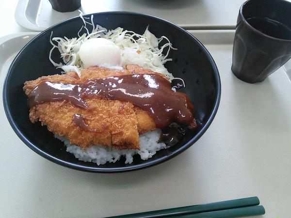

% Test bed
% orumin
% Date is here

# Introduction
## Who are you?

\begin{minipage}[t]{0.5\textwidth}
  \begin{itemize}
    \item orumin
    \item student
  \end{itemize}
\end{minipage}
\hspace*{0.5cm}
\begin{minipage}{0.5\textwidth}
  \begin{figure}[H]
    \begin{flushright}
      \includegraphics[scale=0.5,clip]{./images/my_image.png}
    \end{flushright}
  \end{figure}
\end{minipage}

##

- Sample Content1
- Sample Content2

# Slide test
## foo bar

- It's fine today 
- Indent test 
    - Indent Content1
    - Indent Content2

[link](http://google.com)

### Image implement



## code quote

```C
#include <stdio.h>
int main(int argc, char *argv[])
{
    puts("Hello, World!\n");
    return 0;
}
```
